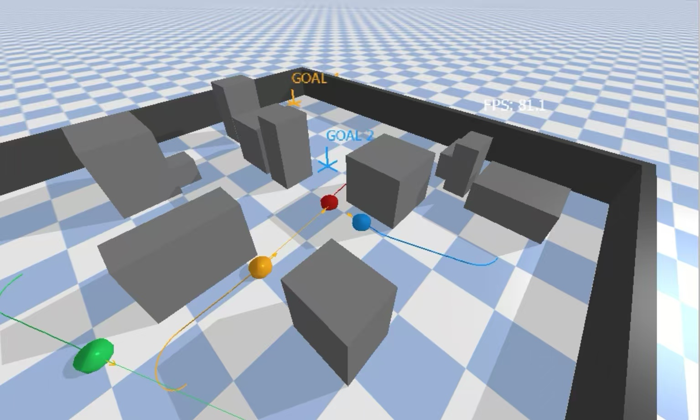
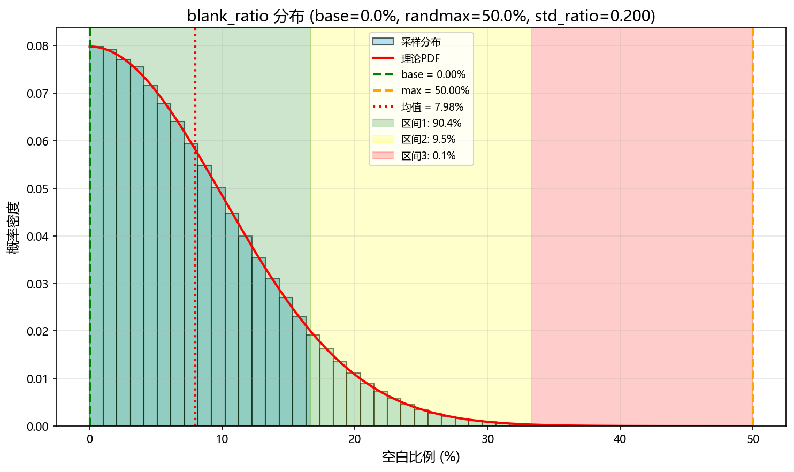
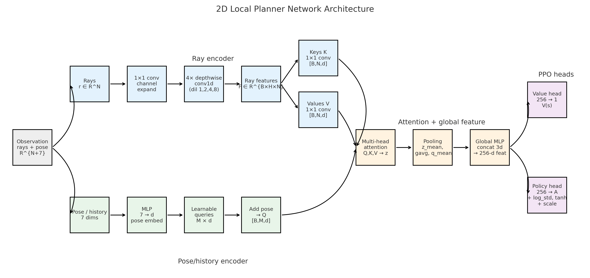

# GRALP (Generalized-depth Ray-Attention Local Planner)

GRALP trains a lightweight PPO local planner on a fully randomized, map-free GPU environment. Observations are vectorized generalized ray/depth (distance-to-obstacle) samples with kinematic history; actions are continuous planar velocity commands. The codebase also ships a one-command exporter that packages the trained policy into a standalone inference API.

GRALP（Generalized-depth Ray-Attention Local Planner）在完全随机化、无地图的 GPU 环境中训练轻量级的 PPO 局部规划器。观测由向量化的广义光线/深度（离障距离）采样和运动学历史组成，动作是连续的平面速度指令。仓库还提供“一键导出”脚本，可将训练好的策略打包为独立的推理 API。



## Quickstart
1) **Install dependencies**
   ```bash
   pip install -r requirements.txt  # numpy + onnx + onnxruntime (CPU)
   # then install torch matching your device (needed for training + setup_api export), e.g.:
   pip install torch --index-url https://download.pytorch.org/whl/cpu
   # or
   pip install torch --index-url https://download.pytorch.org/whl/cu121
   # for GPU ONNX export/inference, swap to:
   # pip install onnxruntime-gpu onnx
   ```
   - `tools/setup_api.py` and `ppo_api` inference rely on `onnx` + `onnxruntime` (or `onnxruntime-gpu`).
   - Optional: install `matplotlib` + `scipy` when running `tools/analyze_blank_ratio.py`.

2) **Configure**
   - `config/env_config.json`
     - `limits`: linear/yaw caps (`vx_max`, `omega_max`).
     - `sim`: `dt`, `safe_distance`, task redraw knobs (`task_point_max_dist_m`, `task_point_success_radius_m`, `task_point_random_interval_max`).
     - `obs`: view geometry (`patch_meters`, `ray_max_gap` for derived ray count) plus empty-ratio sampling controls (`blank_ratio_base`, `blank_ratio_randmax`, `blank_ratio_std_ratio`) and optional narrow-passage Gaussian distances (`narrow_passage_gaussian`, `narrow_passage_std_ratio`).
     - `reward`: collision/progress/time/jerk weights and `orientation_verify` gate.
   - `config/train_config.json`
     - `device`: `cuda:0` (default) or `cpu`; `env_config` file name to load.
     - `sampling`: `batch_env` (e.g., 2048 GPU envs), `rollout_len`, `reset_each_rollout`.
     - `ppo`: discount (`gamma`), `gae_lambda`, clipping, optimizer lrs (`lr`, `value_lr`), `epochs`, `minibatch_size`, `entropy_coef`, `value_coef`, `max_grad_norm`, AMP toggles (`amp`, `amp_bf16`), `collision_done`, `log_std_min/max`.
     - `model`: attention shape (`num_queries`, `num_heads`).
     - `run`: `total_env_steps`, `ckpt_dir`, `log_interval`.

3) **Train**
   ```bash
   python -m rl_ppo.ppo_train --train_config config/train_config.json
   ```
   On startup you can create a new checkpoint (`y`) or resume from the latest checkpoint under `run.ckpt_dir` (`n`).

## 快速开始
1) **安装依赖**
   ```bash
   pip install -r requirements.txt  # 包含 numpy + onnx + onnxruntime(CPU)
   # 再安装与你设备匹配的 torch（训练和 setup_api 导出需要），例如：
   pip install torch --index-url https://download.pytorch.org/whl/cpu
   # 或
   pip install torch --index-url https://download.pytorch.org/whl/cu121
   # 如需 GPU ONNX 导出/推理，改为：
   # pip install onnxruntime-gpu onnx
   ```
   - `tools/setup_api.py` 和 `ppo_api` 推理依赖 `onnx` + `onnxruntime`（或 `onnxruntime-gpu`，用于 CUDA/TRT）。
   - 选装：运行 `tools/analyze_blank_ratio.py` 时可安装 `matplotlib`、`scipy`。

2) **配置文件**
   - `config/env_config.json`
     - `limits`：线速度/角速度上限（`vx_max`, `omega_max`）。
     - `sim`：`dt`、安全距离与任务点重采样（`safe_distance`, `task_point_max_dist_m`, `task_point_success_radius_m`, `task_point_random_interval_max`）。
     - `obs`：视野参数（`patch_meters`, `ray_max_gap` 用于推导射线数量），空/障比例采样控制（`blank_ratio_base`, `blank_ratio_randmax`, `blank_ratio_std_ratio`），以及可选的狭窄通道高斯距离采样（`narrow_passage_gaussian`, `narrow_passage_std_ratio`）。
     - `reward`：碰撞/进度/时间/jerk 权重和 `orientation_verify` 开关。
   - `config/train_config.json`
     - `device`：默认 `cuda:0`（可设为 `cpu`）；`env_config` 指定加载的环境配置文件。
     - `sampling`：`batch_env`（如 2048 个 GPU 环境）、`rollout_len`、`reset_each_rollout`。
     - `ppo`：折扣系数 `gamma`、`gae_lambda`、裁剪范围、优化器学习率（`lr`, `value_lr`）、`epochs`、`minibatch_size`、`entropy_coef`、`value_coef`、`max_grad_norm`、AMP 开关（`amp`, `amp_bf16`）、`collision_done`、`log_std_min/max`。
     - `model`：注意力形状（`num_queries`, `num_heads`）。
     - `run`：`total_env_steps`, `ckpt_dir`, `log_interval`。

3) **开始训练**
   ```bash
   python -m rl_ppo.ppo_train --train_config config/train_config.json
   ```
   启动时可选择创建新检查点（输入 `y`），或从 `run.ckpt_dir` 下的最新检查点恢复（输入 `n`）。

## Standalone Inference Export
- Requires `torch`, `onnx`, and `onnxruntime` (or `onnxruntime-gpu`). `pip install -r requirements.txt` plus the right torch wheel covers export and inference.
- Run `python tools/setup_api.py` to rebuild `ppo_api/`: it copies `tools/api_example`, syncs limits/dt/FOV/attention fields from `config/env_config.json` and `config/train_config.json`, picks the newest `.pt` under `run.ckpt_dir` (defaults to `runs/`), exports ONNX with the derived ray count, then cleans any new `.onnx` files left in the checkpoint folder.
- Use via `from ppo_api.inference import PPOInference`; set `execution_provider` in `ppo_api/config.json` to `cpu`/`cuda`/`tensorrt` (defaults to CPU). The generated `ppo_api/README.md` documents the validated inputs and IO layout.

## 独立推理导出
- 需要安装 `torch`、`onnx` 和 `onnxruntime`（或 `onnxruntime-gpu`）；`pip install -r requirements.txt` 加合适的 torch wheel 即可覆盖导出与推理。
- 运行 `python tools/setup_api.py` 重建 `ppo_api/`：复制 `tools/api_example` 模板；从 `config/env_config.json` 与 `config/train_config.json` 同步 limits/dt/FOV/attention 等关键参数；在 `run.ckpt_dir`（默认 `runs/`）下选择最新的 `.pt` 权重；按推导的射线数量导出 ONNX，并清理检查点目录中新生成的 `.onnx`。
- 使用时 `from ppo_api.inference import PPOInference`；可在 `ppo_api/config.json` 或初始化时指定 `execution_provider=cpu/cuda/tensorrt`（默认 CPU），输入/输出格式详见生成的 `ppo_api/README.md`。

## Repository Layout
- `env/`
  - `sim_gpu_env.py`: Batched randomized ray environment (SimRandomGPUBatchEnv) with per-step FOV resampling and task-point rewards.
  - `ray.py`: Ray count utilities used when `n_rays==0`.
  - `utils.py`: Logging helpers and JSON config loader.
- `rl_ppo/`
  - `ppo_train.py`: PPO training entrypoint.
  - `ppo_models.py`: Shared-encoder Gaussian policy and value head with tanh-squashed actions.
  - `encoder.py`: RayEncoder backbone (ray convolutions + multi-query, multi-head attention) that outputs a 256-d latent.
  - `ppo_buffer.py`: GAE-Lambda rollout buffer.
  - `ppo_utils.py`: Discounted return helpers, checkpoint utilities, AMP guards, and reproducibility tools.
- `config/`
  - `env_config.json`: Environment, observation, and reward settings.
  - `train_config.json`: PPO hyperparameters and run configuration.
- `tools/`
  - `setup_api.py`: One-command exporter that builds a self-contained `ppo_api/` with the newest checkpoint and synced configs.
  - `api_example/`: Template for the exported inference package.
- `runs/`: Default checkpoint/output directory (created at runtime).

## 目录结构
- `env/`
  - `sim_gpu_env.py`：批量随机化的光线环境（SimRandomGPUBatchEnv），支持每步视场重新采样和任务点奖励。
  - `ray.py`：当 `n_rays==0` 时使用的光线数量工具函数。
  - `utils.py`：日志工具和 JSON 配置加载器。
- `rl_ppo/`
  - `ppo_train.py`：PPO 训练入口。
  - `ppo_models.py`：共享编码器的高斯策略与价值头，动作使用 `tanh` 压缩。
  - `encoder.py`：RayEncoder 主干（光线卷积 + 多查询多头注意力），输出 256 维潜在向量。
  - `ppo_buffer.py`：GAE-Lambda 轨迹缓冲。
  - `ppo_utils.py`：折扣回报工具、检查点管理、AMP 保护和可复现性辅助。
- `config/`
  - `env_config.json`：环境、观测与奖励配置。
  - `train_config.json`：PPO 超参数与运行配置。
- `tools/`
  - `setup_api.py`：一键导出脚本，使用最新检查点与配置生成独立的 `ppo_api/`。
  - `api_example/`：导出推理包的模板。
- `runs/`：默认的检查点与输出目录（运行时生成）。

## GPU Randomized Environment


- **Per-step FOV resampling**: Each GPU sub-environment redraws per-ray distances every step using an empty/obstacle mask derived from `blank_ratio_base` plus Gaussian jitter (`blank_ratio_randmax`, `blank_ratio_std_ratio`). Empty rays are filled with the full view radius while obstacle rays sample distances.
- **Gaussian narrow passages (optional)**: When `narrow_passage_gaussian` is true, obstacle distances follow a half-Gaussian with std = `patch_meters * narrow_passage_std_ratio`, producing clustered close obstacles; otherwise distances are uniform within the view radius.
- **Task points without global maps**: Task points are sampled within `task_point_max_dist_m` and clipped to LOS using the sampled rays; redraw cadence is controlled by `task_point_random_interval_max`.

## GPU 随机环境
- **每步视场重采样**：每个 GPU 子环境每步重新生成射线距离，先用基准空白率 `blank_ratio_base` 加高斯抖动（`blank_ratio_randmax`, `blank_ratio_std_ratio`）得到空/障掩码，空白射线填充视野半径，障碍射线再采样距离。
- **可选高斯狭窄通道**：当 `narrow_passage_gaussian` 为真时，障碍距离服从半高斯分布（标准差为 `patch_meters * narrow_passage_std_ratio`），使障碍更集中；否则在视野半径内均匀采样。
- **无全局地图的任务点**：任务点在 `task_point_max_dist_m` 内随机生成，并按当前射线的 LOS 裁剪，可通过 `task_point_random_interval_max` 控制重绘频率。

## Observation & Action
- Observation layout (dimension `R + 7`): `[rays_norm(R), sin_ref, cos_ref, prev_vx/lim, prev_omega/lim, Δvx/(2·lim), Δomega/(2·omega_max), dist_to_task/patch_meters]`.
- Actions are `(vx, vy, omega)`, clipped by `limits` each step. When only two columns are provided, `vy` is zeroed inside the environment.

## 观测与动作
- 观测向量维度为 `R + 7`：`[rays_norm(R), sin_ref, cos_ref, prev_vx/lim, prev_omega/lim, Δvx/(2·lim), Δomega/(2·omega_max), dist_to_task/patch_meters]`。
- 动作为 `(vx, vy, omega)`，每步按 `limits` 裁剪；若只提供两列，环境会将 `vy` 置零。

## GRALP Network (policy/value)


- **RayEncoder backbone** (`rl_ppo/encoder.py`)
  - **Ray branch**: 1D depthwise-separable convolutions with GELU + squeeze-excite blocks to embed per-ray distances.
  - **Attention fusion**: Multi-query, multi-head attention over the ray features; pose/history MLP provides query bias; outputs `[B, num_queries, d_model]` plus global averages.
  - **Fusion head**: Concatenates attended rays, global averages, and mean queries → two-layer MLP → 256-d latent.
- **Policy head** (`rl_ppo/ppo_models.py`)
  - Linear map from 256-d latent to mean action, global learnable `log_std` clamped to `[log_std_min, log_std_max]`.
  - Tanh-squashed Gaussian; scaled by per-axis `limits`; supports evaluation and log-prob correction for PPO.
- **Value head**: Two-layer MLP from the shared latent to a scalar state value.

## GRALP 网络（策略/价值）
- **RayEncoder 主干**（`rl_ppo/encoder.py`）
  - **光线路径**：1D 深度可分卷积 + GELU + Squeeze-Excite，用于编码每条光线距离。
  - **注意力融合**：在光线特征上进行多查询多头注意力；姿态/历史 MLP 提供查询偏置；输出 `[B, num_queries, d_model]` 及全局平均值。
  - **融合头**：拼接注意力输出、全局平均和查询均值 → 两层 MLP → 256 维潜在表示。
- **策略头**（`rl_ppo/ppo_models.py`）
  - 将 256 维潜在映射到动作均值，使用全局可学习的 `log_std`，并限制在 `[log_std_min, log_std_max]`。
  - 经过 `tanh` 压缩的高斯分布，再按各轴 `limits` 缩放；支持评估与 PPO 的对数概率修正。
- **价值头**：从共享潜在通过两层 MLP 输出状态价值。

## Reward Highlights (SimRandomGPUBatchEnv)
- Progress toward the task point: `-Δd / (vx_max · dt)`, optionally gated by `orientation_verify`.
- Collision penalty: `- w_collision * (1 + |v_world| / vx_max)` when the traveled path exceeds the available ray distance (>0).
- Jerk penalties on `vx` and `omega`, saturation penalty `w_limits`, and time penalty `reward_time` per step.
- `collision_done` (default true) resets only the collided sub-env; there is no timeout termination.

## 奖励要点（SimRandomGPUBatchEnv）
- 朝任务点的进度奖励：`-Δd / (vx_max · dt)`，可选由 `orientation_verify` 控制。
- 碰撞惩罚：当行进路径超过剩余可用光线距离（>0）时，惩罚 `- w_collision * (1 + |v_world| / vx_max)`。
- 对 `vx` 和 `omega` 的加加速度（jerk）惩罚，动作饱和惩罚 `w_limits`，以及每步的时间惩罚 `reward_time`。
- `collision_done`（默认 true）仅重置发生碰撞的子环境，没有超时终止。
