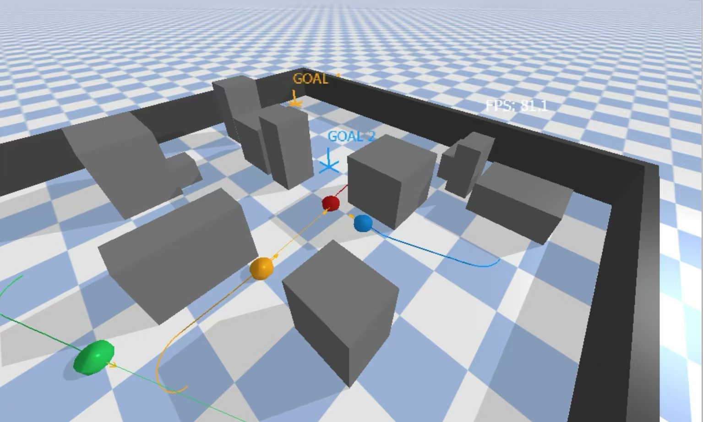
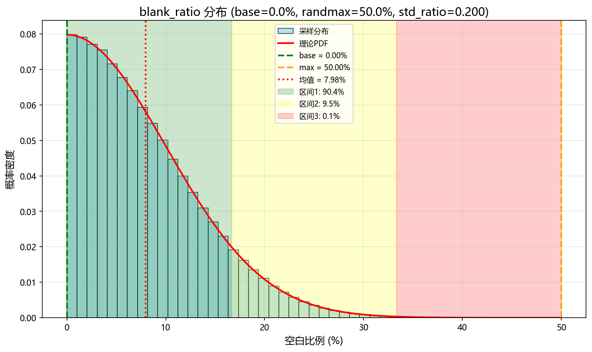
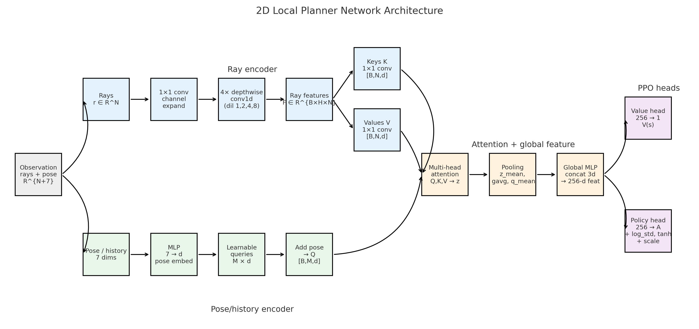

# GRALP (Generalized-depth Ray-Attention Local Planner)

GRALP trains a lightweight PPO local planner on a **fully randomized, map-free** GPU environment. Observations are vectorized generalized ray/depth (distance-to-obstacle) samples with kinematic history; actions are continuous planar velocity commands. The codebase also ships a one-command exporter that packages the trained policy into a standalone inference API.

GRALP（Generalized-depth Ray-Attention Local Planner）在 **完全随机化、无地图** 的 GPU 环境中训练轻量级的 PPO 局部规划器。观测由向量化的广义光线/深度（离障距离）采样和运动学历史组成，动作是连续的平面速度指令。仓库还提供“一键导出”脚本，可将训练好的策略打包为独立的推理 API。



## Quickstart
1) **Install dependencies**
   ```bash
   pip install -r requirements.txt  # numpy + onnx + onnxruntime (CPU)
   # then install torch matching your device (needed for training + setup_api export), e.g.:
   pip install torch --index-url https://download.pytorch.org/whl/cpu
   # or
   pip install torch --index-url https://download.pytorch.org/whl/cu121
   # for GPU ONNX export/inference, swap to:
   # pip install onnxruntime-gpu onnx
   ```
   - `tools/setup_api.py` and `ppo_api` inference rely on `onnx` + `onnxruntime` (or `onnxruntime-gpu`).
   - Optional: install `matplotlib` + `scipy` when running `tools/analyze_blank_ratio.py`.

2) **Configure**
   The configs you'll actually tune live under `config/`. `train_config.json` is a standard PPO hyperparameter set (`sampling.batch_env × rollout_len` is the update batch size, `ppo.*` are the usual Adam / clip / epochs / minibatch / entropy / value knobs plus AMP toggles, `model.num_queries/num_heads` shape the attention head, `run.ckpt_dir` is the root for per-run subdirectories) — it should look familiar if you've used PPO before. The knobs that actually change *task difficulty* and *observation shape* live in `env_config.json`; the table below calls out the ones worth understanding first.

   | Parameter | Section | What it controls | Notes |
   |---|---|---|---|
   | `patch_meters` | `obs` | View radius in meters. With `ray_max_gap` determines ray count `R = ⌈2π · patch_meters / ray_max_gap⌉`. | Changes observation dim `R + 7`; old checkpoints / ONNX are incompatible after editing. |
   | `ray_max_gap` | `obs` | Max arc-length gap (meters) between adjacent rays at the view boundary. Smaller → more rays. | Same: changes observation dim. |
   | `blank_ratio_base` / `blank_ratio_randmax` | `obs` | Per-env empty-ray proportion (%). Effective value is sampled from `N(base, randmax · std_ratio)` clamped to `[base, base + randmax]`. | Main obstacle-density curriculum lever; lower → denser obstacles. |
   | `narrow_passage_gaussian` / `narrow_passage_std_ratio` | `obs` | When true, obstacle distances follow a half-Gaussian with `σ = patch_meters · std_ratio`, clustering obstacles close. Otherwise uniform within view radius. | Turn on to train for narrow-corridor traversal. |
   | `safe_distance` | `sim` | Minimum obstacle distance required for **task-point spawn directions** (meters). | ⚠️ Does **not** affect collision detection — only filters where the goal can appear. |
   | `task_point_max_dist_m` / `task_point_random_interval_max` | `sim` | Goal spawn radius cap, and max steps between automatic re-draws (`0` = single-goal episodes). | Effective spawn cap is `min(this, patch_meters)`. |
   | `orientation_verify` | `reward` | When true, progress reward is positive **only if** the robot is getting closer (`Δd < 0`) **and** its heading is aligned with its velocity (`cos(heading, v) > 0`). | Off: robot may crab or reverse toward the goal; on: forces forward-oriented driving. |
   | `reward_collision` / `reward_progress` / `reward_limits` / `reward_jerk` / `reward_jerk_omega` / `reward_time` | `reward` | Reward-shaping weights; exact forms live in `env/sim_gpu_env.py`. | Changing any of these changes the task — don't mix results across values. |

3) **Train**
   ```bash
   # start from scratch — creates <ckpt_dir>/<timestamp>[-<tag>]/
   python -m rl_ppo.ppo_train --fresh [--tag NAME]
   # warm-start a new run from an existing checkpoint or tag
   python -m rl_ppo.ppo_train --fresh --resume <path-or-tag> [--tag NAME] [--opt]
   # continue an existing run (path to a run dir / step-<N>.pt, or a tag)
   python -m rl_ppo.ppo_train --resume <path-or-tag>
   ```
   `--fresh` always creates a new run folder under `run.ckpt_dir` and copies `config/train_config.json` + `config/env_config.json` into it. Checkpoints are saved as `step-<N>.pt`, and `latest.pt` is overwritten on every save. `--resume` accepts a directory, a specific `step-<N>.pt`, or a **tag** — when a tag is given, the latest `*-<tag>` folder (by mtime) is selected. Pure `--resume` always loads optimizer state; `--fresh --resume` loads weights only unless `--opt` is passed. `--tag` is only valid with `--fresh` (for naming the new folder); the external `train_config.json` path is fixed at `config/train_config.json` and cannot be overridden from the CLI.

## 快速开始
1) **安装依赖**
   ```bash
   pip install -r requirements.txt  # 包含 numpy + onnx + onnxruntime(CPU)
   # 再安装与你设备匹配的 torch（训练和 setup_api 导出需要），例如：
   pip install torch --index-url https://download.pytorch.org/whl/cpu
   # 或
   pip install torch --index-url https://download.pytorch.org/whl/cu121
   # 如需 GPU ONNX 导出/推理，改为：
   # pip install onnxruntime-gpu onnx
   ```
   - `tools/setup_api.py` 和 `ppo_api` 推理依赖 `onnx` + `onnxruntime`（或 `onnxruntime-gpu`，用于 CUDA/TRT）。
   - 选装：运行 `tools/analyze_blank_ratio.py` 时可安装 `matplotlib`、`scipy`。

2) **配置文件**
   实际需要调参的两个 JSON 都在 `config/` 下。`train_config.json` 是一套标准的 PPO 超参(`sampling.batch_env × rollout_len` 为一次更新的样本量;`ppo.*` 对应 Adam 学习率/裁剪/epochs/minibatch/熵系数/价值系数和 AMP 开关;`model.num_queries` / `num_heads` 控制注意力头形状;`run.ckpt_dir` 是所有 run 子目录的根)——用过 PPO 的话里面的字段应该都不陌生。真正会影响**任务难度**和**观测形状**的旋钮集中在 `env_config.json`,表格列出最值得先理解的几个:

   | 参数 | 所在节 | 作用 | 注意事项 |
   |---|---|---|---|
   | `patch_meters` | `obs` | 视野半径(米)。与 `ray_max_gap` 一起决定射线数 `R = ⌈2π · patch_meters / ray_max_gap⌉`。 | 改动后观测维度 `R + 7` 会变,已训好的 ckpt / ONNX 不再兼容。 |
   | `ray_max_gap` | `obs` | 视野边界上相邻射线之间允许的最大弧长间隔(米),越小射线越密。 | 同上:会改观测维度。 |
   | `blank_ratio_base` / `blank_ratio_randmax` | `obs` | 每个子环境的"空射线比例"(%)。实际值采样自 `N(base, randmax · std_ratio)`,再裁到 `[base, base + randmax]`。 | 控制障碍密度分布的主要 curriculum 旋钮,值越低障碍越密。 |
   | `narrow_passage_gaussian` / `narrow_passage_std_ratio` | `obs` | 打开时,障碍距离服从半高斯 `σ = patch_meters · std_ratio`,近处障碍更集中;关闭时在视野半径内均匀采样。 | 训"窄通道穿越"类任务时建议打开。 |
   | `safe_distance` | `sim` | 任务点生成方向所要求的**最小障碍距离**(米)。 | ⚠️ **不影响**碰撞判定,只决定目标点能出现在哪些方向上。 |
   | `task_point_max_dist_m` / `task_point_random_interval_max` | `sim` | 任务点生成半径上限,以及自动重采样的最大步数间隔(`0` 表示单目标 episode)。 | 实际上限为 `min(此值, patch_meters)`。 |
   | `orientation_verify` | `reward` | 打开时,progress 奖励**仅当**机器人在靠近目标(`Δd < 0`)**且**朝向与速度方向一致(`cos(heading, v) > 0`)时才能为正。 | 关闭:允许侧移/倒车拉近目标也得奖励;打开:强制"正前方"行进。 |
   | `reward_collision` / `reward_progress` / `reward_limits` / `reward_jerk` / `reward_jerk_omega` / `reward_time` | `reward` | 奖励项权重,具体计算式见 `env/sim_gpu_env.py`。 | 改这些等于换任务,不同权重之间的结果不要混着比。 |

3) **开始训练**
   ```bash
   # 从零开始,自动生成 <ckpt_dir>/<时间戳>[-<tag>]/
   python -m rl_ppo.ppo_train --fresh [--tag NAME]
   # 热启动(新开目录,从已有 ckpt / tag 载入权重)
   python -m rl_ppo.ppo_train --fresh --resume <path-or-tag> [--tag NAME] [--opt]
   # 续训(传目录、具体的 step-<N>.pt,或一个 tag)
   python -m rl_ppo.ppo_train --resume <path-or-tag>
   ```
   `--fresh` 总是在 `run.ckpt_dir` 下创建新子目录,并把 `config/train_config.json` 与 `config/env_config.json` 拷贝进去。检查点保存为 `step-<N>.pt`,同时覆盖写入 `latest.pt`。`--resume` 可以接受目录、具体 `step-<N>.pt`,或者一个 **tag** —— 传 tag 时会选择 `runs/` 下最新的 `*-<tag>` 目录(按 mtime)。纯 `--resume` 默认会加载 optimizer;`--fresh --resume` 只加载权重,除非显式加 `--opt`。`--tag` 只在 `--fresh` 模式下有效(用来给新目录命名);外层 `train_config.json` 的位置固定为 `config/train_config.json`,不再通过命令行指定。

## Standalone Inference Export
```bash
python tools/setup_api.py
```
- Requires `torch`, `onnx`, and `onnxruntime` (or `onnxruntime-gpu`). `pip install -r requirements.txt` plus the right torch wheel covers export and inference.
- Rebuilds `ppo_api/`: copies `tools/api_example`, syncs limits/dt/FOV/attention fields from `config/env_config.json` and `config/train_config.json`, picks the newest `latest.pt` under `run.ckpt_dir` (falling back to the newest `step-<N>.pt`; defaults to `runs/`), exports ONNX with the derived ray count, then cleans any new `.onnx` files left in the checkpoint folder.
- Use via `from ppo_api.inference import PPOInference`; set `execution_provider` in `ppo_api/config.json` to `cpu`/`cuda`/`tensorrt` (defaults to CPU). The generated `ppo_api/README.md` documents the validated inputs and IO layout.

## 独立推理导出
```bash
python tools/setup_api.py
```
- 需要安装 `torch`、`onnx` 和 `onnxruntime`（或 `onnxruntime-gpu`）；`pip install -r requirements.txt` 加合适的 torch wheel 即可覆盖导出与推理。
- 重建 `ppo_api/`：复制 `tools/api_example` 模板；从 `config/env_config.json` 与 `config/train_config.json` 同步 limits/dt/FOV/attention 等关键参数；在 `run.ckpt_dir`（默认 `runs/`）下选择最新的 `latest.pt`（若没有则回退到最新的 `step-<N>.pt`）；按推导的射线数量导出 ONNX，并清理检查点目录中新生成的 `.onnx`。
- 使用时 `from ppo_api.inference import PPOInference`；可在 `ppo_api/config.json` 或初始化时指定 `execution_provider=cpu/cuda/tensorrt`（默认 CPU），输入/输出格式详见生成的 `ppo_api/README.md`。

## Repository Layout
```text
GRALP/
├── config/
│   ├── env_config.json          # environment / observation / reward knobs
│   └── train_config.json        # PPO hyperparameters + run settings
├── env/
│   ├── sim_gpu_env.py           # batched randomized ray environment (SimRandomGPUBatchEnv)
│   ├── ray.py                   # ray-count derivation utilities
│   └── utils.py                 # JSON config loader + logging helpers
├── rl_ppo/
│   ├── ppo_train.py             # training entrypoint (CLI: --fresh / --resume)
│   ├── ppo_models.py            # tanh-squashed Gaussian policy + value head
│   ├── encoder.py               # RayEncoder backbone (conv + multi-query attention)
│   ├── ppo_buffer.py            # GAE-Lambda rollout buffer
│   └── ppo_utils.py             # checkpoint / AMP / reproducibility helpers
├── tools/
│   ├── setup_api.py             # one-command ONNX exporter → ppo_api/
│   ├── analyze_blank_ratio.py   # visualize the blank_ratio sampling distribution
│   └── api_example/             # template for the exported inference package
├── assets/                      # figures referenced in this README
├── runs/                        # created at training time: <timestamp>[-<tag>]/
├── requirements.txt
└── README.md
```

## 目录结构
```text
GRALP/
├── config/
│   ├── env_config.json          # 环境 / 观测 / 奖励配置
│   └── train_config.json        # PPO 超参 + 运行配置
├── env/
│   ├── sim_gpu_env.py           # 批量随机化光线环境（SimRandomGPUBatchEnv）
│   ├── ray.py                   # 射线数量推导工具
│   └── utils.py                 # JSON 配置加载 + 日志辅助
├── rl_ppo/
│   ├── ppo_train.py             # 训练入口（CLI: --fresh / --resume）
│   ├── ppo_models.py            # tanh 压缩高斯策略 + 价值头
│   ├── encoder.py               # RayEncoder 主干（光线卷积 + 多查询注意力）
│   ├── ppo_buffer.py            # GAE-Lambda 轨迹缓冲
│   └── ppo_utils.py             # 检查点 / AMP / 可复现性辅助
├── tools/
│   ├── setup_api.py             # 一键 ONNX 导出 → ppo_api/
│   ├── analyze_blank_ratio.py   # 可视化 blank_ratio 采样分布
│   └── api_example/             # 导出推理包模板
├── assets/                      # README 引用的图片
├── runs/                        # 训练时生成：<timestamp>[-<tag>]/
├── requirements.txt
└── README.md
```

## GPU Randomized Environment


- **Per-step FOV resampling**: Each GPU sub-environment redraws per-ray distances every step using an empty/obstacle mask derived from `blank_ratio_base` plus Gaussian jitter (`blank_ratio_randmax`, `blank_ratio_std_ratio`). Empty rays are filled with the full view radius while obstacle rays sample distances.
- **Gaussian narrow passages (optional)**: When `narrow_passage_gaussian` is true, obstacle distances follow a half-Gaussian with std = `patch_meters * narrow_passage_std_ratio`, producing clustered close obstacles; otherwise distances are uniform within the view radius.
- **Task points without global maps**: Task points are sampled within `task_point_max_dist_m` and clipped to LOS using the sampled rays; redraw cadence is controlled by `task_point_random_interval_max`.

## GPU 随机环境
- **每步视场重采样**：每个 GPU 子环境每步重新生成射线距离，先用基准空白率 `blank_ratio_base` 加高斯抖动（`blank_ratio_randmax`, `blank_ratio_std_ratio`）得到空/障掩码，空白射线填充视野半径，障碍射线再采样距离。
- **可选高斯狭窄通道**：当 `narrow_passage_gaussian` 为真时，障碍距离服从半高斯分布（标准差为 `patch_meters * narrow_passage_std_ratio`），使障碍更集中；否则在视野半径内均匀采样。
- **无全局地图的任务点**：任务点在 `task_point_max_dist_m` 内随机生成，并按当前射线的 LOS 裁剪，可通过 `task_point_random_interval_max` 控制重绘频率。

## Observation & Action
- Observation layout (dimension `R + 7`): `[rays_norm(R), sin_ref, cos_ref, prev_vx/lim, prev_omega/lim, Δvx/(2·lim), Δomega/(2·omega_max), dist_to_task/patch_meters]`.
- Actions are `(vx, vy, omega)`, clipped by `limits` each step. When only two columns are provided, `vy` is zeroed inside the environment.

## 观测与动作
- 观测向量维度为 `R + 7`：`[rays_norm(R), sin_ref, cos_ref, prev_vx/lim, prev_omega/lim, Δvx/(2·lim), Δomega/(2·omega_max), dist_to_task/patch_meters]`。
- 动作为 `(vx, vy, omega)`，每步按 `limits` 裁剪；若只提供两列，环境会将 `vy` 置零。

## GRALP Network (policy/value)


- **RayEncoder backbone** (`rl_ppo/encoder.py`)
  - **Ray branch**: 1D depthwise-separable convolutions with GELU + squeeze-excite blocks to embed per-ray distances.
  - **Attention fusion**: Multi-query, multi-head attention over the ray features; pose/history MLP provides query bias; outputs `[B, num_queries, d_model]` plus global averages.
  - **Fusion head**: Concatenates attended rays, global averages, and mean queries → two-layer MLP → 256-d latent.
- **Policy head** (`rl_ppo/ppo_models.py`)
  - Linear map from 256-d latent to mean action, global learnable `log_std` clamped to `[log_std_min, log_std_max]`.
  - Tanh-squashed Gaussian; scaled by per-axis `limits`; supports evaluation and log-prob correction for PPO.
- **Value head**: Two-layer MLP from the shared latent to a scalar state value.

## GRALP 网络（策略/价值）
- **RayEncoder 主干**（`rl_ppo/encoder.py`）
  - **光线路径**：1D 深度可分卷积 + GELU + Squeeze-Excite，用于编码每条光线距离。
  - **注意力融合**：在光线特征上进行多查询多头注意力；姿态/历史 MLP 提供查询偏置；输出 `[B, num_queries, d_model]` 及全局平均值。
  - **融合头**：拼接注意力输出、全局平均和查询均值 → 两层 MLP → 256 维潜在表示。
- **策略头**（`rl_ppo/ppo_models.py`）
  - 将 256 维潜在映射到动作均值，使用全局可学习的 `log_std`，并限制在 `[log_std_min, log_std_max]`。
  - 经过 `tanh` 压缩的高斯分布，再按各轴 `limits` 缩放；支持评估与 PPO 的对数概率修正。
- **价值头**：从共享潜在通过两层 MLP 输出状态价值。

## Reward Highlights (SimRandomGPUBatchEnv)
- Progress toward the task point: `-Δd / (vx_max · dt)`, optionally gated by `orientation_verify`.
- Collision penalty: `- w_collision * (1 + |v_world| / vx_max)` when the traveled path exceeds the available ray distance (>0).
- Jerk penalties on `vx` and `omega`, saturation penalty `w_limits`, and time penalty `reward_time` per step.
- `collision_done` (default true) resets only the collided sub-env; there is no timeout termination.

## 奖励要点（SimRandomGPUBatchEnv）
- 朝任务点的进度奖励：`-Δd / (vx_max · dt)`，可选由 `orientation_verify` 控制。
- 碰撞惩罚：当行进路径超过剩余可用光线距离（>0）时，惩罚 `- w_collision * (1 + |v_world| / vx_max)`。
- 对 `vx` 和 `omega` 的加加速度（jerk）惩罚，动作饱和惩罚 `w_limits`，以及每步的时间惩罚 `reward_time`。
- `collision_done`（默认 true）仅重置发生碰撞的子环境，没有超时终止。
