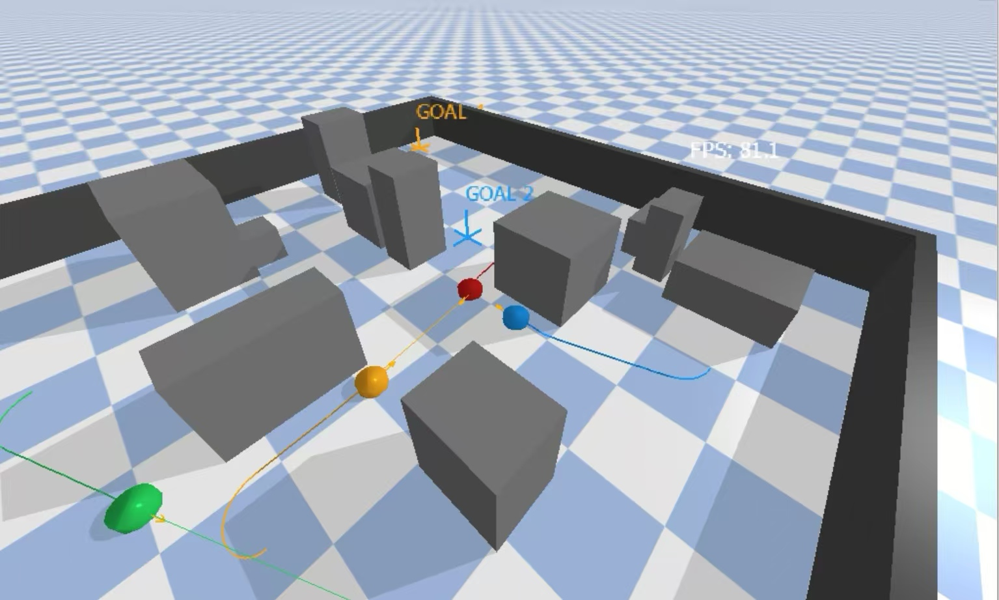
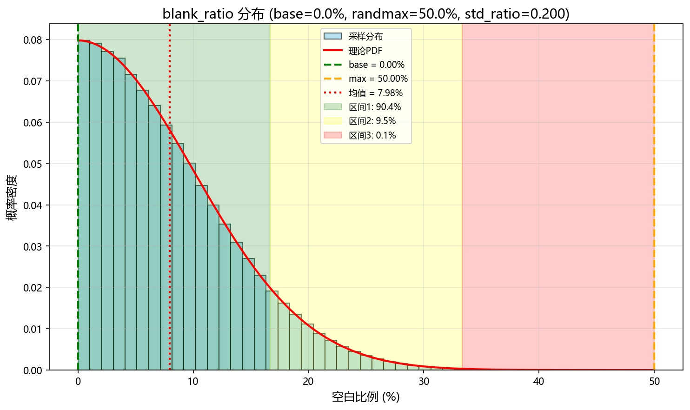

# GRALP

GRALP 是一个面向移动机器人局部导航与轨迹规划的轻量级 PPO 策略训练仓库。项目以二维激光雷达距离作为主要外部感知输入，不依赖相机、深度图、语义检测、全局地图或局部栅格，策略在批量随机化的射线环境中学习从局部观测到连续速度指令的映射。

核心目标是用尽量紧凑的观测和网络结构，在低成本差速移动平台上生成满足速度约束、避碰约束和控制平滑性的局部可执行轨迹。



## 方法概览

每个控制周期中，环境提供一圈归一化二维激光射线距离、局部目标方向和短时控制历史。策略输出差速平台的连续动作 `(vx, omega)`，动作经 `tanh` 压缩后按轴映射到物理速度边界。连续动作序列再通过差速运动学积分，形成滚动局部轨迹。

本文方法对应的主干网络是 `cnn_zeropad`：射线分支使用零填充空洞一维卷积提取几何特征，姿态-历史分支使用小型 MLP 编码 7 维辅助状态，两路特征融合后共享给策略头和价值头。零填充在这里不是单纯的长度保持技巧；由于归一化距离中的 `0` 表示贴近障碍，序列两端的零填充会形成与车体前向轴绑定的隐式方向锚点，使卷积主干在不额外加入方向位置编码的情况下区分前方左右几何。

仓库也保留了若干可切换编码器，统一由 `config/model_config.json` 定义、由 `config/train_config.json` 的 `model` 字段选择：

| Key | Encoder | 用途 |
|---|---|---|
| `cnn_zeropad` | 零填充空洞一维卷积 + 姿态 MLP | 论文方法主干 |
| `cnn_circular` | 环形填充空洞一维卷积 + 姿态 MLP | 保留射线环形拓扑的可选结构 |
| `circular_attn` | 环形卷积 + 多查询多头注意力 | 可选注意力结构 |
| `mlp_2` 至 `mlp_5` | 直接处理扁平观测向量的 MLP | 简单基线结构 |

## 观测与动作

观测向量长度为 `R + 7`：

```text
[rays_norm(R),
 sin_goal, cos_goal,
 prev_vx_norm, prev_omega_norm,
 delta_vx_norm, delta_omega_norm,
 task_dist_norm]
```

其中 `R = ceil(2 * pi * patch_meters / ray_max_gap)`。当前默认配置下 `patch_meters = 10.0`、`ray_max_gap = 0.6`，因此 `R = 105`，观测维度为 `112`。修改这两个参数会改变观测维度，已有 checkpoint 和 ONNX 模型通常不能继续兼容。

动作为二维 `(vx, omega)`：

- `vx_forward_only = true` 时，`vx` 被映射到 `[0, vx_max]`，策略不会输出后退速度。
- `omega` 被映射到 `[-omega_max, omega_max]`。
- 训练时环境向策略提供形状为 `[action_dim, 2]` 的动作上下界；导出的 ONNX 图使用 `obs` 和 `limits` 作为输入。

## 随机化训练环境

训练环境位于 `env/sim_gpu_env.py`。它不是固定地图仿真，而是每步在 GPU 上批量重采样一圈射线距离：

- `blank_ratio_base`、`blank_ratio_randmax`、`blank_ratio_std_ratio` 控制每个子环境中的空射线比例分布。
- `narrow_passage_gaussian` 打开后，障碍距离按半高斯分布采样，使近距离障碍和窄通道情形出现得更频繁。
- 任务点从当前射线可见方向中采样，并被投影为当前视线内最近可见的局部目标点。
- 奖励由目标进度、速度耦合碰撞惩罚和控制平滑性惩罚组成。



## 安装

先安装基础依赖：

```bash
pip install -r requirements.txt
```

再按设备安装 PyTorch。示例：

```bash
# CPU
pip install torch --index-url https://download.pytorch.org/whl/cpu

# CUDA 12.1
pip install torch --index-url https://download.pytorch.org/whl/cu121
```

`tools/export_onnx.py` 需要 `torch` 和 `onnxruntime`。如果要在 GPU 上做 ONNX 推理或导出校验，可将 `onnxruntime` 换成 `onnxruntime-gpu`。

## 配置

主要配置文件都在 `config/`：

| 文件 | 作用 |
|---|---|
| `train_config.json` | PPO 采样规模、优化超参、日志和 checkpoint 设置，并通过 `model` 字段选择编码器 |
| `env_config.json` | 速度边界、仿真周期、任务点采样、奖励权重和射线观测参数 |
| `model_config.json` | 各类编码器的结构参数 |

如果要按论文方法训练，请确认 `config/train_config.json` 中：

```json
"model": "cnn_zeropad"
```

当前仓库也允许选择 `cnn_circular`、`circular_attn` 或 `mlp_*`，但不同结构训练出的权重不能混用。

## 训练

训练入口是 `rl_ppo.train`：

```bash
# 新建一次训练，生成 runs/<timestamp>[-<tag>]/
python -m rl_ppo.train --fresh --tag cnn_zeropad

# 新建目录并从已有 checkpoint 或 tag 热启动
python -m rl_ppo.train --fresh --resume <path-or-tag> --tag finetune

# 在已有 run 上继续训练
python -m rl_ppo.train --resume <path-or-tag>
```

说明：

- `--fresh` 会创建新的 run 目录，并把当前 `train_config.json`、`env_config.json`、`model_config.json` 复制进去。
- `--resume` 可以传 run 目录、具体 `step-<N>.pt`、`latest.pt`，或已有 tag。
- 纯 `--resume` 会加载优化器状态；`--fresh --resume` 默认只加载策略权重，如需同时加载优化器状态可加 `--opt`。
- TensorBoard 会随训练自动启动，默认端口为 `6006`，可用 `--port` 修改。

## 导出 ONNX

训练完成后可以把 checkpoint 导出成自包含的 `model/` 文件夹：

```bash
# 按 tag 定位最新 run
python tools/export_onnx.py --tag cnn_zeropad

# 指定某个 checkpoint
python tools/export_onnx.py --ckpt runs/<run>/latest.pt --model cnn_zeropad

# 指定输出目录
python tools/export_onnx.py --ckpt runs/<run>/latest.pt --model cnn_zeropad -o exported_model
```

导出产物：

```text
model/
├── policy.pt
├── policy.onnx
└── meta.json
```

`policy.onnx` 的输入为 `obs` 和 `limits`，输出为确定性动作 `action`、预压缩均值 `mu` 和 `log_std`。导出脚本会用同一批随机输入分别运行 PyTorch 和 ONNX Runtime，确认数值一致后才完成。

## 代码结构

```text
GRALP/
├── config/
│   ├── env_config.json          # 环境、观测、动作边界和奖励配置
│   ├── model_config.json        # 编码器结构配置
│   └── train_config.json        # PPO 训练与运行配置
├── env/
│   ├── sim_gpu_env.py           # 批量随机化射线环境
│   ├── ray.py                   # 射线数量和射线扫描工具
│   └── utils.py                 # JSON 配置与日志工具
├── models/
│   ├── policy.py                # PPOPolicy：tanh 高斯策略 + 价值头
│   └── encoders/
│       ├── cnn_zeropad.py       # 零填充空洞一维卷积编码器
│       ├── cnn_circular.py      # 环形填充一维卷积编码器
│       ├── circular_attn.py     # 环形卷积注意力编码器
│       └── mlp.py               # MLP 编码器
├── rl_ppo/
│   ├── train.py                 # PPO 训练入口
│   ├── buffer.py                # rollout buffer 与 GAE
│   └── writer.py                # TensorBoard 日志工具
├── tools/
│   ├── export_onnx.py           # checkpoint 到 ONNX/model 文件夹
│   └── analyze_blank_ratio.py   # blank_ratio 分布可视化工具
├── assets/                      # README 图片资源
├── runs/                        # 训练输出目录
├── requirements.txt
└── README.md
```

## 使用注意

- 修改 `patch_meters` 或 `ray_max_gap` 会改变射线数和观测维度，需要重新训练或重新导出匹配模型。
- 修改 `train_config.json` 的 `model` 后，新旧 checkpoint 只有在编码器结构完全一致时才能加载。
- `vx_forward_only` 会改变动作边界和上一帧速度的归一化方式，部署侧需要使用 `meta.json` 中记录的同一动作约束。
- `runs/` 目录通常包含大量 checkpoint，提交代码时应只保留确实需要发布的模型文件。
